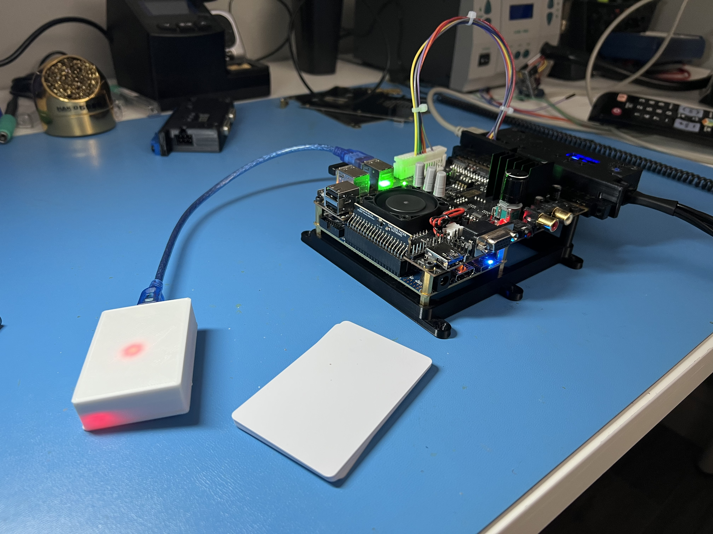

Forked from: [javiwwweb/MisTerRFID](https://github.com/javiwwweb/MisTerRFID)
Most of the ReadMe below is copy/paste from javiwwweb. I have added some notes for my changes.

:heavy_exclamation_mark: ~~This code is built for use with games in the _Arcade folder. I may expand this further at a later date.~~ 

Update 09/25/2022: This code *can* be used to run games other than Arcade cores. There is a caveat: you cannot use the "write" card method to add games. You **must** add games manually to the `rfid_process.sh` file. If you want to add a game, you must get the card number first, and then add a line such as this to the case statement:

`"123456789011") play "games/CONSOLEHERE/gamename.extension" ;;`

Be aware that you *can* overwrite a card, though. If accidentally overwrite a card number by using the write card, you will indeed delete that line and need to re-add it.

:heavy_exclamation_mark:

# Table of Contents
- [TL;DR Instructions](#tldr)
- [Hardware Needed](#hardware-needed)
- [Arduino Hardware Setup](#arduino-hardware-setup)
- [Write Card Setup](#write-card-setup)
- [MiSTer Setup](#mister-setup)
- [Use](#use)
    - [Assigning Games to Cards](#assigning-games-to-cards)
    - [Home Assistant Function](#home-assistant-function-optional)
- [Known Issues](#known-issues)
- [Troubleshooting](#troubleshooting)

# MisTerRFID

Enables RFID card launching of games for MiSTer FPGA. Launches games without any menu being display using the MiSTer Game Launcher files (MGL) method. Must use a version of MiSTer from Feb 24, 2022 or after to support this method of launching.

_This version allows you to assign games to cards without needing to edit the `rfid_process.sh` file._

## Hardware Needed

- Arduino Nano V3.0
- RC522 RFID Card Reader Module Board (3.3V)
- Mi-fare door access cards
- MiSTer FPGA with the extra USB ports board.

## Arduino Hardware Setup

| RC522 Module Pin | Arduino Pin |
| ---------------- | ----------- |
| RST              | D9          |
| SDA              | D10         |
| MOSI             | D11         |
| MISO             | D12         |
| SCK              | D13         |
| VCC              | 3.3V        |
| GRD              | GRD         |

:warning: Skipping steps below will cause your code to not function! :warning:

Install the `Easy MFRC522` library through your Arduino IDE. Write the misterrfid.ino file to your Arduino. If you find out that that you would like to extend the distance the card is picked up, You can adjust the receiver gain by editing line `21` of the `misterrfid.ino` and upload the code.

```
    rfid.PCD_SetRegisterBitMask(rfid.RFCfgReg, (0x03<<4)); // RFID Gain
```

The HEX 0x03 control the gain. In my case that was the value that would penetrate the wooden bezel and the glass at the perfect distance. You may need to adjust this value set the receiver's gain to your desired level

| Gain Values in HEX |
| ------------------ |
| 0x01 = 23 dB HEX   |
| 0x02 = 18 dB HEX   |
| 0x03 = 23 dB HEX   |
| 0x04 = 33 dB HEX   |
| 0x05 = 38 dB HEX   |
| 0x06 = 43 dB HEX   |
| 0x07 = 48 dB HEX   |

On your computer, attach the serial monitor to your Arduino and you should see it repeating `. rfid_process.sh noscan` about every second. As soon as your scan a RFID card, it should output `. rfid_process.sh 12345678`. The number is that card's unique ID. The reader will not scan the same card two times in a row, but you can scan another card, and then the original in order to see a card's number again.

### Write Card Setup

As you are gathering numbers from your cards or RFID tags, choose an RFID device that you'd like to use as a `write card` This card acts as a trigger to put your Arduino code into a loop that will run the `rfid_write.sh` file. The number of this RFID device needs to be replace `12346789` in `misterrfid.ino` at line `58`. After you have done this, overwrite your Arduino with the new code. Set that card aside for later.

```
  const uint32_t wCard = 123456789;

```

## MiSTer Setup

Copy the files to your MiSTer SD card based on the structure of this repo. _(Optional)_ Edit case statement of the `rfid_process.sh` script. The line-structure is as follows:

```
case "$1" in
"1234567890") play "Street Fighter II' Hyper Fighting -World 921209-" ;;
esac
```

Note that the roms need to be the filename only, without the extension (no .mra). Spaces are important and so are quotations. Take care when adding files this way.

:warning: When adding files manually be careful not to move the beginning of the `case` statement from line 13.:warning:

Doing so will cause the `rfid_write.sh` file to break. If you _do_ need to move the `case` block around, please check the comment in `rfid_write.sh` to move your injection point for creating new games."

This function is set up for \_Arcade games only, but can be easily adapted to other cores. I would suggest looking at [illusion-pasure-program](https://github.com/illusion-pasture-program/snesRFID)'s `original rfid_process.sh` file

## Use

After editing the `rfid_process.sh` script, turn off your MiSTer. Plug your Arduino into an available USB port on your USB board module and turn on your MiSTer. Depending on how many scripts you have running, it can take up to 30 seconds from first turning on the power to the RFID reader becoming available. Once the RFID is available, you can start lunching games (if you added cases to the `rfid_process.sh` file), or begin [Assigning Games to Cards](#Assigning-Games-to-Cards)

Note: This can be combined with MisTer.ini option bootcore= to automatically launch an arcade core (MRA file) upon starting up your MisTer. The `rfid_process.sh` will run in the background waiting for a card to be presented.

## Assigning Games to Cards

First, launch a game using the core menu. Once the game has booted, scan your `write card`. This will tell the Arduino that it needs to run the `rfid_write.sh` file on the next card scan. Scan a new (or already assigned) card. The card will be programaticaly added to `rfid_process.sh` and the next time you scan that card, it will boot the game. Remember that you cannot scan the same card twice, though. Scan a different card before scanning the just-written one in order to test it.

_Cards can be overwritten. If you attempt to scan a card that is already added to the `rfid_process.sh` file, the entry will be deleted and then reassigned to the new game. You can do this as often as you'd like._


## Home Assistant Function _(Optional)_

In the `rfid_process.sh`, there's an `ha_cmd` function. It's an _extremely_ simple cUrl command that uses a bearer token and accepts a JSON string. It leverages the [Home Assistant API](https://www.home-assistant.io/integrations/api/). Please refer to the [Home Assistant API Docs](https://developers.home-assistant.io/docs/api/rest/) for detailed information. 

You will need:
- An API Token
- API enabled in `configuration.yaml`
- The URL of your instance + the necessary API action

The quick and dirty version is as follows:

- Log in to Home Assistant as your normal (admin) user
- Go to settings > Users
- Create a new user with:   
  - A name like `LocalApiUser`
  - A secure password
  - Toggle the "Can only log in from the local network" to on
- Log out or open a private window 
- Log in to Home Assistant as the API User
- In the bottom left, click on the profile icon
- Scroll to "Long-Lived Access Tokens" and `Create Token`
- name the token something memorable, and copy it down. You cannot see it again after closing the window.
- Paste the token into the `TOKEN` variable in `rfid_process.sh` between the quotes.
- Create cases using RFID cards that include the request and the `ha_cmd`. Example below:

```
ha_cmd() {
        TOKEN="abcdefghijklmnop35920942029034809234ljflkjsalfkj"
        curl -X POST -H "Authorization: Bearer $TOKEN" -H "Content-Type: application/json" -d $1 $2 
}

case "$1" in 
"1234567890") ha_cmd {"entity_id":"light.living_room_lights"}' "http://homeassistant.local:8123/api/services/light/turn_off";;
esac
```

## Known Issues

~~Games with two spaces in the name are having one of the spaces removed as the game name is passed through the string manipulation logic.~~
~~E.g.~~
```
Street Fighter II'  Champion Edition -World 920513- -> Street Fighter II' Champion Edition -World 920513-
```
~~This makes the MiSTer unable to find the rbf file. Some regex will probably fix this. I'll revisit it soon.~~

This seems to be fixed.

## Troubleshooting

- If your cards don't seem to be scanning in MiSTer, make sure that `serial_listen.sh` actually started. I have had issues with that not booting in the past. Re-imaging my SD card takes care of this if nothing else.
- If games aren't being added to the right spot, or being injected in odd places in `rfid_process.sh` make sure you didn't inadvertently move the `case` statement. Read [MiSTer Setup](#MiSTer-Setup).
- If your write card doesn't function. Make sure you added the card number to the Arduino code **and** re-uploaded after making that change.

## TL;DR

- Set up your Arduino and MFRC522

| RC522 Module Pin | Arduino Pin |
| ---------------- | ----------- |
| RST              | D9          |
| SDA              | D10         |
| MOSI             | D11         |
| MISO             | D12         |
| SCK              | D13         |
| VCC              | 3.3V        |
| GRD              | GRD         |

- Write the code to the Arduino
- Pick a card to be the `write card` and jot down the number
- Replace the value for `const uint32_t wCard` in `misterrfid.ino` with your card number
- Re-write to the arduino
- Add Scripts files to the `Scripts` folder on the MiSTer, as well as the linux file


### THANK YOU

_Thanks to illusion-pasture-program and javiwwweb for the initial code and ideas._
